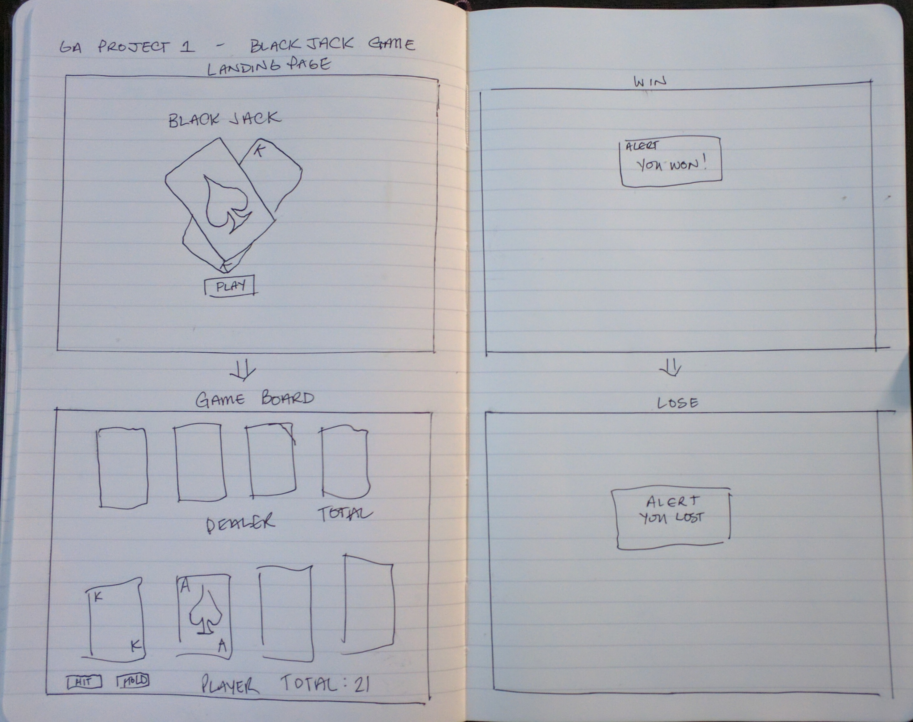

[BlackJack]

What is [BlackJack]?

BlackJacks a fun game that involves getting cards to add up to 21 and 
beating your opponent. Always had fun playing it with friends so lets
try to program it!

Technical Discussion

List of the technologies you're using (HTML, CSS, JavaScript)
Notes on Game Structure
HTML to establish the page
CSS to gussy it up!
JavaScript will be used for game logic and getting the cards moving!

Code samples, description of challenges you overcame, etc.
The Making of [BlackJack]

coming soon!

Any credits or notes you feel you should add
Opportunities for Future Growth

If you had more time to work on your game, what would you do?
